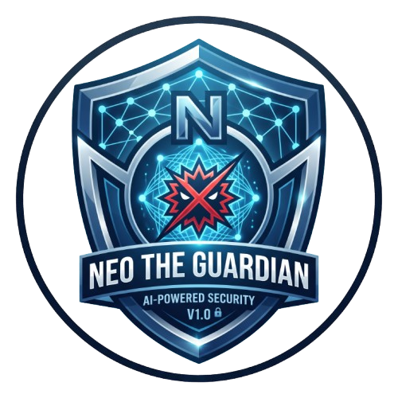
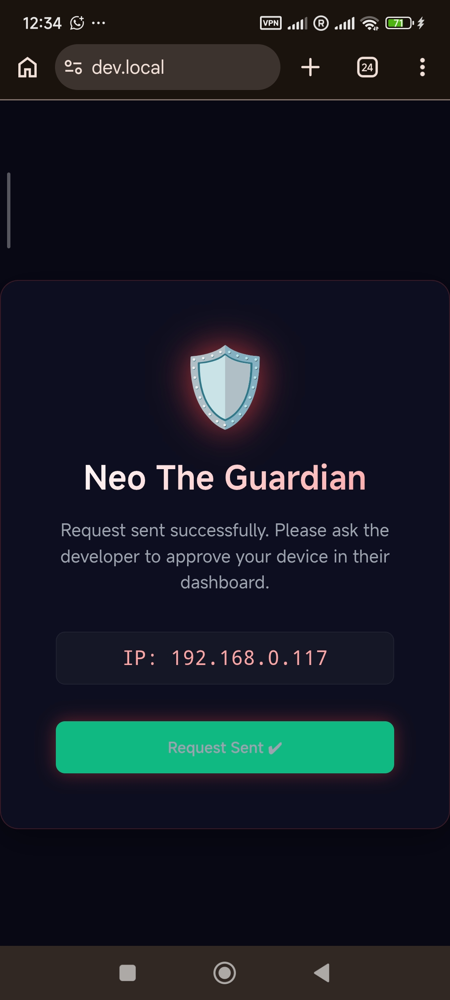
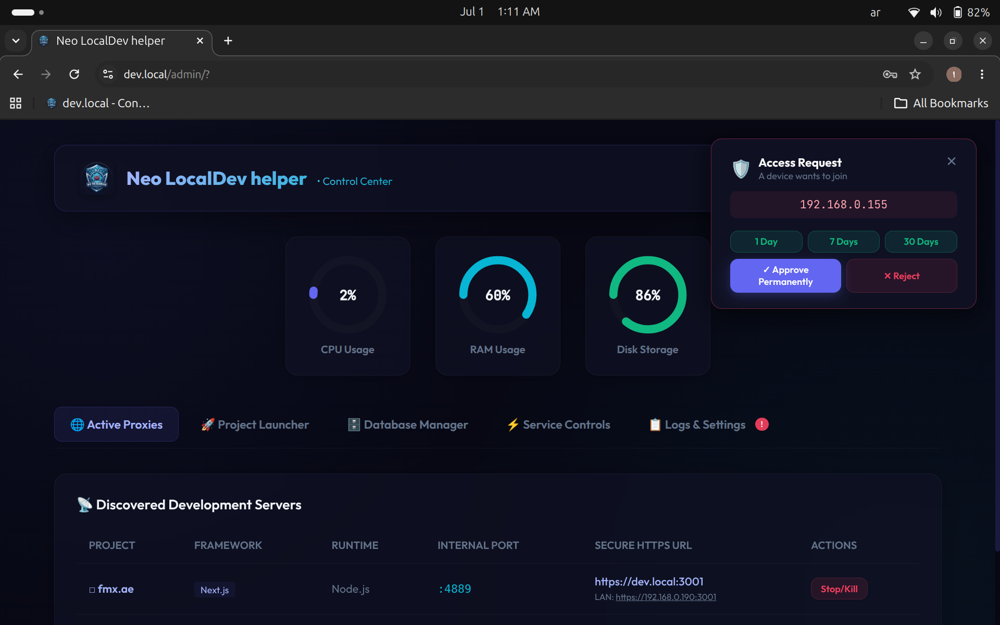
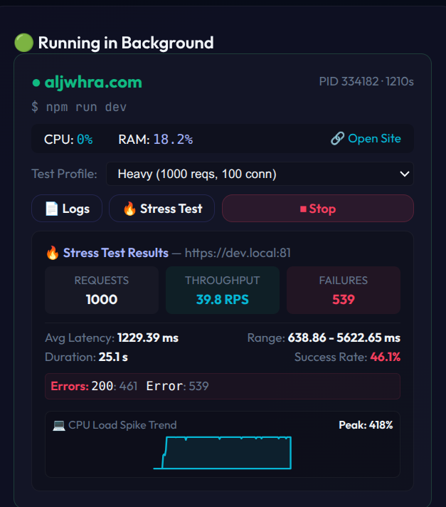

<div align="center">



# ⚡ Neo LocalDev

**Lightweight Local Development Gateway & Reverse Proxy**

[](LICENSE)
[](https://kernel.org)
[](https://python.org)
[](https://sdhost.org)

*Your local machine — your private cloud. Secure, smart, and developer-first.*

</div>

---

## 📖 What is Neo LocalDev?

**Neo LocalDev** is a self-hosted local development gateway that transforms your Linux machine into a secure, professional-grade development environment — with zero cloud dependency, full HTTPS, automatic project discovery, and a sleek web-based control dashboard.

Built for solo developers and small teams who want a real dev server experience locally — no more `localhost:3000` juggling. Instead, access all your projects cleanly via subdomain-style routing through `https://dev.local`, protected by SSL certificates you trust.

> Think of it as **ngrok + nginx + a dev panel** — all in one lightweight Python tool that runs entirely on your machine.

<div align="center">
  <video src="assets/demo.webm" width="100%" controls></video>
</div>

---

## ✨ Features

### 🔐 Security — NEO THE GUARDIAN
- **Device Whitelist System** — Only pre-approved devices on your network can access your dashboard and projects
- **Auto IP Detection** — The host machine's LAN IP is automatically whitelisted on startup, so you're never locked out of your own machine
- **Unauthorized Access Page** — Blocked devices see a branded page and can request access; you approve/deny with a single click
- **Port Isolation** — All running dev servers are forced to bind to `127.0.0.1` only, preventing direct external connections
- **HTTPS Only** — All traffic routes through SSL (via `mkcert`), no plain HTTP access

#### 🛡️ Neo The Guardian Device Authentication Flow
| 1. Device Requests Access | 2. Admin Receives & Approves Request |
| :---: | :---: |
|  |  |


### 🖥️ Web Control Dashboard
- Beautiful dark glassmorphism UI at `https://dev.local/admin/`
- Real-time CPU, RAM, and Disk gauges
- Start/stop/restart services (MariaDB, Caddy, phpMyAdmin)
- Live system logs (Caddy access/error, API server)
- **HTTP Stress Tester** — Load test any running project with live CPU spike chart and failure breakdown
- Guardian device manager — approve or reject network access requests

<div align="center">



</div>

### 📦 PHP Extensions Manager
- Browse all installed and available PHP extensions
- Toggle extensions on/off with an animated iOS-style switch
- Install missing extensions with a single click
- Supports passwordless sudo (via setup) or prompts securely with a masked password modal
- Provides manual terminal commands if you choose not to use the dashboard

### 🚀 Project Auto-Discovery
- Automatically detects running `node`, `Next.js`, `Vite`, `Laravel`, `Python` dev servers
- Routes each project through a dedicated HTTPS port via Caddy reverse proxy
- Watches for new projects and hot-reloads the proxy config without downtime

### 🗄️ Database & Tools
- MariaDB integration — start/stop from the dashboard
- Bundled **phpMyAdmin** client accessible at `https://dev.local/pma/`
- One-click MariaDB service control

### 🔑 Certificate Management
- SSL certs generated by `mkcert` — trusted by your browser automatically
- Trusted in system stores (Debian/Ubuntu, Fedora, Arch) and Chrome/Firefox NSS databases
- Cert renewal via `neold cert-renew`

---

## 📋 Requirements

| Dependency | Install |
|---|---|
| **Linux** (Debian/Ubuntu recommended) | — |
| **Python 3.8+** | `sudo apt install python3` |
| **python3-psutil** | Auto-installed by `setup.sh` |
| **python3-yaml** | Auto-installed by `setup.sh` |
| **Caddy** | `sudo apt install caddy` |
| **mkcert** | Auto-installed by `setup.sh` |
| **MariaDB** *(optional)* | `sudo apt install mariadb-server` |

---

## 🚀 Installation

### 1. Clone the repository

```bash
git clone https://github.com/sdhost-tec/Neo-Local-Dev-Helper.git
cd Neo-Local-Dev-Helper
```

### 2. Run the setup script

```bash
sudo ./setup.sh
```

The setup script will:
- Install `python3-psutil` and `python3-yaml` system packages
- Download and install `mkcert` (if not already installed)
- Trust the local CA in your system and browser stores
- Install the `neold` command globally to `/usr/local/bin/`
- Configure passwordless sudo rules for PHP extension management
- Run initial SSL certificate generation and Caddy configuration

### 3. Start the gateway

```bash
neold start
```

Then open your browser at: **`https://dev.local/admin/`**

> **Default credentials:** `admin` / `admin` (change via your config file)

---

## 🛠️ Usage — CLI Commands

| Command | Description |
|---|---|
| `neold start` | Start the gateway (Caddy + API + Watcher) |
| `neold stop` | Stop all services |
| `neold reload` | Reload proxy configuration without downtime |
| `neold status` | Show running status, ports, and active projects |
| `neold config` | Print current configuration |
| `neold cert-renew` | Force-renew SSL certificates |
| `neold cert-trust` | Re-trust certificates in system and browser stores |
| `neold start -f` | Start in foreground (useful for debugging) |

---

## � Access from Android Devices

To browse your local dev environment from your Android phone on the same Wi-Fi network:

### 1. Map the local domain

Install **[Virtual Switch Hosts](https://play.google.com/store/apps/details?id=com.virtual_switch_hosts.app)** from the Play Store — it lets you add custom `/etc/hosts` entries on Android without root.

Open the app and add a new entry:

```
192.168.x.x    dev.local
```

> Replace `192.168.x.x` with your dev machine's LAN IP. You can find it in the dashboard under **Settings → LAN Address**.

Enable the switch in the app.

### 2. Trust the SSL certificate

Since `mkcert` generates a local CA that Android doesn't trust by default, you need to install the root certificate:

1. Download `rootCA.pem` from your dev machine — it's in the project root, or grab it directly:
   ```
   https://192.168.x.x/admin/rootCA.pem
   ```
2. On your Android phone go to **Settings → Security → Install certificate → CA certificate**
3. Select the downloaded `rootCA.pem` file

### 3. Browse

Open Chrome on your phone and go to:

```
https://dev.local/admin/
```

---

## �📁 Project Structure

```
neo-localdev/
├── NeoLocalDev/                # Core Python package
│   ├── api_server.py           # Dashboard web server (HTTP handler + HTML)
│   ├── cli.py                  # CLI entry point and command handlers
│   ├── config.py               # Config loader, LAN IP detection, path helpers
│   ├── certs.py                # SSL certificate generation and trust management
│   ├── detector.py             # Running dev-server auto-discovery
│   ├── proxy.py                # Caddy reverse proxy generator + Guardian filter
│   ├── installer.py            # phpMyAdmin and service installer
│   ├── db_manager.py           # MariaDB service controller
│   ├── watcher.py              # File-system watcher for new projects
│   └── watcher_daemon.py       # Background watcher subprocess entry point
├── neo.png                     # Application logo / favicon
├── rootCA.pem                  # mkcert root CA — install on Android & other LAN devices
├── neold                       # Shell wrapper entrypoint script
├── setup.sh                    # Installer script (run with sudo)
├── uninstall.sh                # Full uninstaller (run with sudo)
└── requirements.txt            # Python dependencies list
```

---

## ⚙️ Configuration

The configuration file is auto-generated at `~/.NeoLocalDev/config.yml` on first setup.

```yaml
domain: dev.local
ssl_dir: ~/.NeoLocalDev/certs
caddy_dir: ~/.NeoLocalDev/caddy
log_dir: ~/.NeoLocalDev/logs
auth_token: <auto-generated>
allowed_ips:
  - 127.0.0.1
  - ::1
  - 192.168.0.XXX  # your LAN IP (auto-detected)
```

> You can edit this file manually to add more allowed IPs or change the admin domain.

---

## 🔒 Security Architecture

```
Internet / LAN
      │
      ▼
┌─────────────────────┐
│   NEO THE GUARDIAN  │  ← IP Whitelist check
│   (Caddy + proxy.py)│  ← Blocks unknown devices
└─────────┬───────────┘
          │ Allowed traffic only
          ▼
┌─────────────────────┐
│   Caddy Reverse     │  ← HTTPS with trusted SSL
│   Proxy (port 443)  │  ← Routes by subdomain/path
└─────────┬───────────┘
          │
     ┌────┴────┐
     ▼         ▼
  /admin/    /pma/    /:project-port/
  Dashboard  phpMyAdmin  Dev Servers
```

All dev server processes are forced to bind to `127.0.0.1` via `CADDY_BIND_HOST` environment variable injection, so they are never directly reachable from the network.

---

## 🗑️ Uninstall

To completely remove Neo LocalDev from your system:

```bash
sudo ./uninstall.sh
```

This will remove:
- All configuration files (`~/.NeoLocalDev/`)
- SSL certificates and CA trust
- The `neold` binary from `/usr/local/bin/`
- Domain entries from `/etc/hosts`
- The sudoers policy file (`/etc/sudoers.d/neold`)

> **Note:** Caddy itself is not removed. Run `sudo apt remove caddy` if you want to uninstall it.

---

## 🤝 Contributing

Contributions, bug reports, and feature requests are welcome!

1. Fork the repository
2. Create your branch: `git checkout -b feature/my-feature`
3. Commit your changes: `git commit -m 'Add my feature'`
4. Push to the branch: `git push origin feature/my-feature`
5. Open a Pull Request

---

## 💌 Contact & Support

- 📧 **Email:** [hq@sdhost.com](mailto:hq@sdhost.com)
- 🌐 **Website:** [sdhost.org](https://sdhost.org)
- 🛡️ **Neo Guardian Portal:** [neo.sdhost.org](https://neo.sdhost.org/)

---

## ☕ Support the Project

If Neo LocalDev has saved you time and improved your workflow, consider buying us a coffee — it helps keep the project alive and actively maintained!

<div align="center">

| Platform | Link |
|---|---|
| ☕ **PayPal** | [paypal.me/IbrahimHagIbrahim](https://paypal.me/IbrahimHagIbrahim) |
| 🎗️ **Ko-fi** | [ko-fi.com/sdhost](https://ko-fi.com/sdhost) |

*Every contribution, big or small, is deeply appreciated. Thank you! 🙏*

</div>

---

## 📄 License

This project is licensed under the **MIT License** — see the [LICENSE](LICENSE) file for details.

---

<div align="center">

**Developed by [sdhost.org](https://sdhost.org)**

© 2026 Royal Service & Tec Solutions. All rights reserved.

*Protected by [🛡️ NEO THE GUARDIAN](https://neo.sdhost.org/)*

</div>
